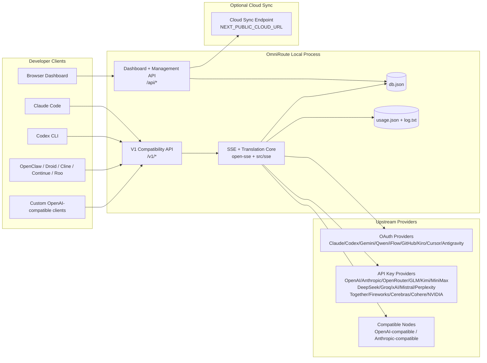
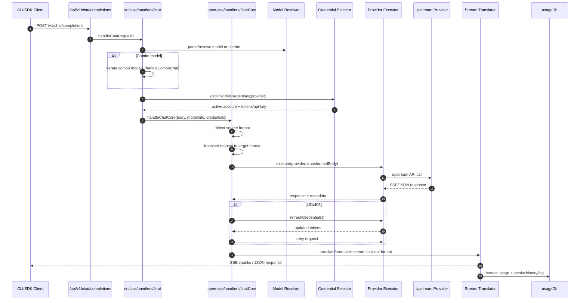
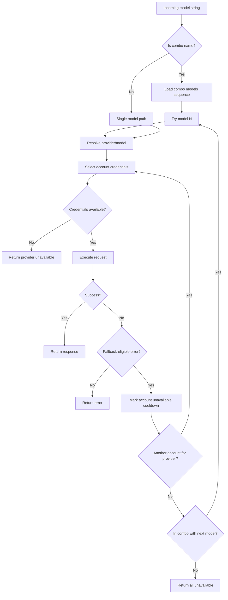
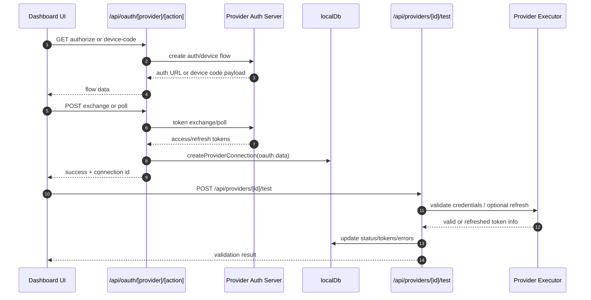
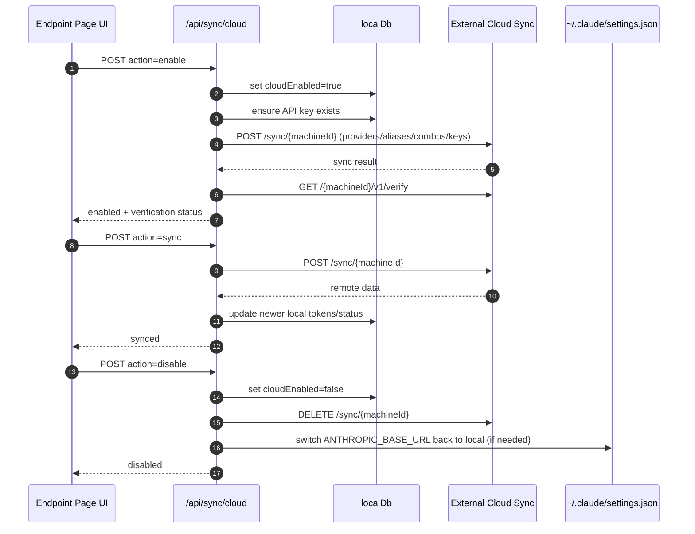
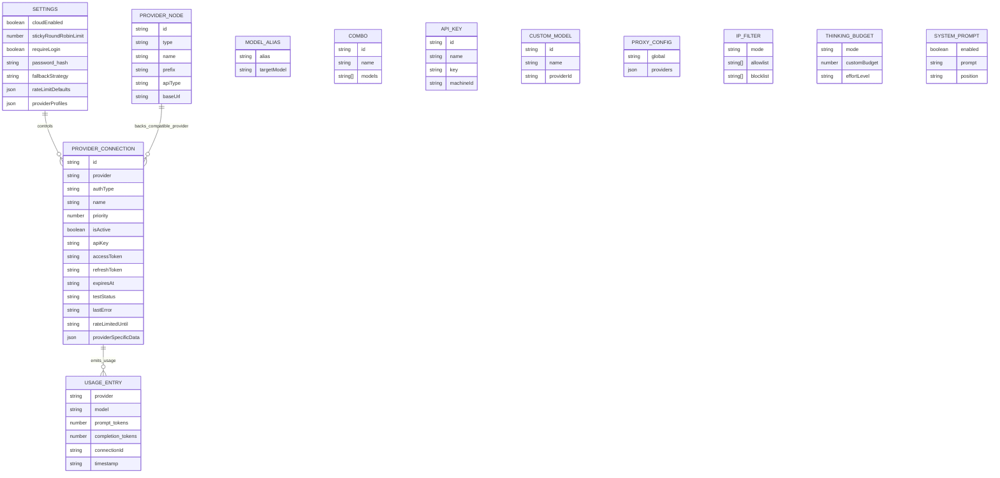
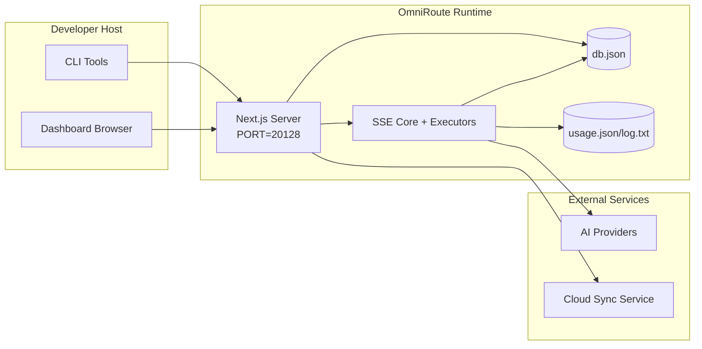

# OmniRoute-arkitektur

🌐 **Languages:** 🇺🇸 [English](../../ARCHITECTURE.md) | 🇧🇷 [Português (Brasil)](../pt-BR/ARCHITECTURE.md) | 🇪🇸 [Español](../es/ARCHITECTURE.md) | 🇫🇷 [Français](../fr/ARCHITECTURE.md) | 🇮🇹 [Italiano](../it/ARCHITECTURE.md) | 🇷🇺 [Русский](../ru/ARCHITECTURE.md) | 🇨🇳 [中文 (简体)](../zh-CN/ARCHITECTURE.md) | 🇩🇪 [Deutsch](../de/ARCHITECTURE.md) | 🇮🇳 [हिन्दी](../in/ARCHITECTURE.md) | 🇹🇭 [ไทย](../th/ARCHITECTURE.md) | 🇺🇦 [Українська](../uk-UA/ARCHITECTURE.md) | 🇸🇦 [العربية](../ar/ARCHITECTURE.md) | 🇯🇵 [日本語](../ja/ARCHITECTURE.md) | 🇻🇳 [Tiếng Việt](../vi/ARCHITECTURE.md) | 🇧🇬 [Български](../bg/ARCHITECTURE.md) | 🇩🇰 [Dansk](../da/ARCHITECTURE.md) | 🇫🇮 [Suomi](../fi/ARCHITECTURE.md) | 🇮🇱 [עברית](../he/ARCHITECTURE.md) | 🇭🇺 [Magyar](../hu/ARCHITECTURE.md) | 🇮🇩 [Bahasa Indonesia](../id/ARCHITECTURE.md) | 🇰🇷 [한국어](../ko/ARCHITECTURE.md) | 🇲🇾 [Bahasa Melayu](../ms/ARCHITECTURE.md) | 🇳🇱 [Nederlands](../nl/ARCHITECTURE.md) | 🇳🇴 [Norsk](../no/ARCHITECTURE.md) | 🇵🇹 [Português (Portugal)](../pt/ARCHITECTURE.md) | 🇷🇴 [Română](../ro/ARCHITECTURE.md) | 🇵🇱 [Polski](../pl/ARCHITECTURE.md) | 🇸🇰 [Slovenčina](../sk/ARCHITECTURE.md) | 🇸🇪 [Svenska](../sv/ARCHITECTURE.md) | 🇵🇭 [Filipino](../phi/ARCHITECTURE.md)

_Sidst opdateret: 2026-02-18_

## Resumé

OmniRoute er en lokal AI-routinggateway og dashboard bygget på Next.js.
Det giver et enkelt OpenAI-kompatibelt slutpunkt (`/v1/*`) og dirigerer trafik på tværs af flere upstream-udbydere med oversættelse, fallback, token-opdatering og brugssporing.

Kerneegenskaber:

- OpenAI-kompatibel API-overflade til CLI/værktøjer (28 udbydere)
- Anmodning/svar oversættelse på tværs af udbyderformater
- Model combo fallback (multi-model sekvens)
- Fallback på kontoniveau (multi-konto pr. udbyder)
- Administration af forbindelse til OAuth + API-nøgleudbyder
- Indlejringsgenerering via `/v1/embeddings` (6 udbydere, 9 modeller)
- Billedgenerering via `/v1/images/generations` (4 udbydere, 9 modeller)
- Tænk tag-parsing (`<think>...</think>`) for ræsonneringsmodeller
- Response sanitization for streng OpenAI SDK-kompatibilitet
- Rollenormalisering (udvikler→system, system→bruger) for kompatibilitet på tværs af udbydere
- Struktureret outputkonvertering (json_schema → Gemini responseSchema)
- Lokal persistens for udbydere, nøgler, aliaser, kombinationer, indstillinger, priser
- Brug/omkostningssporing og anmodningslogning
- Valgfri skysynkronisering til synkronisering af flere enheder/tilstande
- IP-tilladelsesliste/blokeringsliste til API-adgangskontrol
- Tænkende budgetstyring (passthrough/auto/custom/adaptive)
- Global system prompt injektion
- Sessionssporing og fingeraftryk
- Forbedret prisbegrænsning pr. konto med udbyderspecifikke profiler
- Circuit breaker mønster for udbyderens modstandsdygtighed
- Anti-tordenbeskyttelse med mutex-låsning
- Signaturbaseret anmodnings deduplikeringscache
- Domænelag: modeltilgængelighed, omkostningsregler, fallback-politik, lockout-politik
- Vedvarende domænetilstand (SQLite-gennemskrivningscache til fallbacks, budgetter, lockouts, strømafbrydere)
- Politikmotor til centraliseret anmodningsevaluering (lockout → budget → fallback)
- Anmod om telemetri med p50/p95/p99 latency aggregering
- Korrelations-ID (X-Request-Id) til ende-til-ende-sporing
- Overholdelsesrevisionslogning med opt-out pr. API-nøgle
- Evalueringsramme for LLM kvalitetssikring
- Resilience UI-dashboard med strømafbryderstatus i realtid
- Modulære OAuth-udbydere (12 individuelle moduler under `src/lib/oauth/providers/`)

Primær runtime model:

- Next.js app-ruter under `src/app/api/*` implementerer både dashboard-API'er og kompatibilitets-API'er
- En delt SSE/routingkerne i `src/sse/*` + `open-sse/*` håndterer udbyderens udførelse, oversættelse, streaming, fallback og brug

## Omfang og grænser

### I omfang

- Lokal gateway køretid
- Dashboard management API'er
- Udbydergodkendelse og tokenopdatering
- Anmod om oversættelse og SSE-streaming
- Lokal stat + vedvarende brug
- Valgfri skysynkroniseringsorkestrering

### Uden for anvendelsesområde

- Cloud-tjenesteimplementering bag `NEXT_PUBLIC_CLOUD_URL`
- Udbyder SLA/kontrolplan uden for lokal proces
- Eksterne CLI-binære filer selv (Claude CLI, Codex CLI osv.)

## Systemkontekst på højt niveau



## Core Runtime Components

## 1) API og Routing Layer (Next.js App Routes)

Hovedmapper:

- `src/app/api/v1/*` og `src/app/api/v1beta/*` for kompatibilitets-API'er
- `src/app/api/*` til administrations-/konfigurations-API'er
- Næste omskrivninger i `next.config.mjs` kort `/v1/*` til `/api/v1/*`

Vigtige kompatibilitetsruter:

- `src/app/api/v1/chat/completions/route.ts`
- `src/app/api/v1/messages/route.ts`
- `src/app/api/v1/responses/route.ts`
- `src/app/api/v1/models/route.ts` — inkluderer brugerdefinerede modeller med `custom: true`
- `src/app/api/v1/embeddings/route.ts` — indlejringsgenerering (6 udbydere)
- `src/app/api/v1/images/generations/route.ts` — billedgenerering (4+ udbydere inkl. Antigravity/Nebius)
- `src/app/api/v1/messages/count_tokens/route.ts`
- `src/app/api/v1/providers/[provider]/chat/completions/route.ts` — dedikeret chat pr. udbyder
- `src/app/api/v1/providers/[provider]/embeddings/route.ts` — dedikerede indlejringer pr. udbyder
- `src/app/api/v1/providers/[provider]/images/generations/route.ts` — dedikerede billeder pr. udbyder
- `src/app/api/v1beta/models/route.ts`
- `src/app/api/v1beta/models/[...path]/route.ts`

Ledelsesdomæner:

- Godkendelse/indstillinger: `src/app/api/auth/*`, `src/app/api/settings/*`
- Udbydere/forbindelser: `src/app/api/providers*`
- Udbyder noder: `src/app/api/provider-nodes*`
- Brugerdefinerede modeller: `src/app/api/provider-models` (GET/POST/DELETE)
- Modelkatalog: `src/app/api/models/catalog` (GET)
- Proxy-konfiguration: `src/app/api/settings/proxy` (GET/PUT/DELETE) + `src/app/api/settings/proxy/test` (POST)
- OAuth: `src/app/api/oauth/*`
- Nøgler/aliaser/kombinationer/priser: `src/app/api/keys*`, `src/app/api/models/alias`, `src/app/api/combos*`, `src/app/api/pricing`
- Anvendelse: `src/app/api/usage/*`
- Synkroniser/sky: `src/app/api/sync/*`, `src/app/api/cloud/*`
- CLI-værktøjshjælpere: `src/app/api/cli-tools/*`
- IP-filter: `src/app/api/settings/ip-filter` (GET/PUT)
- Tænkende budget: `src/app/api/settings/thinking-budget` (GET/PUT)
- Systemprompt: `src/app/api/settings/system-prompt` (GET/PUT)
- Sessioner: `src/app/api/sessions` (GET)
- Satsgrænser: `src/app/api/rate-limits` (GET)
- Modstandsdygtighed: `src/app/api/resilience` (GET/PATCH) — udbyderprofiler, strømafbryder, hastighedsgrænsetilstand
- Resilience reset: `src/app/api/resilience/reset` (POST) — nulstil breakers + cooldowns
- Cachestatistik: `src/app/api/cache/stats` (GET/DELETE)
- Modeltilgængelighed: `src/app/api/models/availability` (GET/POST)
- Telemetri: `src/app/api/telemetry/summary` (GET)
- Budget: `src/app/api/usage/budget` (GET/POST)
- Fallback-kæder: `src/app/api/fallback/chains` (GET/POST/DELETE)
- Overholdelsesrevision: `src/app/api/compliance/audit-log` (GET)
- Evaler: `src/app/api/evals` (GET/POST), `src/app/api/evals/[suiteId]` (GET)
- Politikker: `src/app/api/policies` (GET/POST)

## 2) SSE + Oversættelseskerne

Hovedflowmoduler:

- Indgang: `src/sse/handlers/chat.ts`
- Kerneorkestrering: `open-sse/handlers/chatCore.ts`
- Leverandørudførelsesadaptere: `open-sse/executors/*`
- Formatdetektion/udbyderkonfiguration: `open-sse/services/provider.ts`
- Modelparse/opløsning: `src/sse/services/model.ts`, `open-sse/services/model.ts`
- Konto fallback logik: `open-sse/services/accountFallback.ts`
- Oversættelsesregister: `open-sse/translator/index.ts`
- Strømtransformationer: `open-sse/utils/stream.ts`, `open-sse/utils/streamHandler.ts`
- Brugsekstraktion/normalisering: `open-sse/utils/usageTracking.ts`
- Tænk tag-parser: `open-sse/utils/thinkTagParser.ts`
- Indlejringshåndtering: `open-sse/handlers/embeddings.ts`
- Indlejring af udbyderregistrering: `open-sse/config/embeddingRegistry.ts`
- Billedgenereringsbehandler: `open-sse/handlers/imageGeneration.ts`
- Billedudbyderregistrering: `open-sse/config/imageRegistry.ts`
- Reaktionssanering: `open-sse/handlers/responseSanitizer.ts`
- Rollenormalisering: `open-sse/services/roleNormalizer.ts`

Tjenester (forretningslogik):

- Kontovalg/score: `open-sse/services/accountSelector.ts`
- Kontekstlivscyklusstyring: `open-sse/services/contextManager.ts`
- Håndhævelse af IP-filter: `open-sse/services/ipFilter.ts`
- Sessionssporing: `open-sse/services/sessionManager.ts`
- Anmod om deduplikering: `open-sse/services/signatureCache.ts`
- Systemprompt indsprøjtning: `open-sse/services/systemPrompt.ts`
- Tænkende budgetstyring: `open-sse/services/thinkingBudget.ts`
- Wildcard model routing: `open-sse/services/wildcardRouter.ts`
- Satsgrænsestyring: `open-sse/services/rateLimitManager.ts`
- Afbryder: `open-sse/services/circuitBreaker.ts`

Domænelagsmoduler:

- Modeltilgængelighed: `src/lib/domain/modelAvailability.ts`
- Omkostningsregler/budgetter: `src/lib/domain/costRules.ts`
- Fallback-politik: `src/lib/domain/fallbackPolicy.ts`
- Combo resolver: `src/lib/domain/comboResolver.ts`
- Lockout-politik: `src/lib/domain/lockoutPolicy.ts`
- Politikmotor: `src/domain/policyEngine.ts` — centraliseret lockout → budget → fallback-evaluering
- Fejlkodekatalog: `src/lib/domain/errorCodes.ts`
- Anmodnings-id: `src/lib/domain/requestId.ts`
- Hente timeout: `src/lib/domain/fetchTimeout.ts`
- Anmod om telemetri: `src/lib/domain/requestTelemetry.ts`
- Overholdelse/revision: `src/lib/domain/compliance/index.ts`
- Evalløber: `src/lib/domain/evalRunner.ts`
- Vedvarende domænetilstand: `src/lib/db/domainState.ts` — SQLite CRUD til reservekæder, budgetter, omkostningshistorik, lockouttilstand, afbrydere

OAuth-udbydermoduler (12 individuelle filer under `src/lib/oauth/providers/`):

- Registerindeks: `src/lib/oauth/providers/index.ts`
- Individuelle udbydere: `claude.ts`, `codex.ts`, `gemini.ts`, `antigravity.ts`, `iflow.ts`, `qwen.ts`, **OMNI*TOKEN***12**TO, **OMNI_TOKEN**\_12**, `kiro.ts`, `cursor.ts`, `kilocode.ts`, `cline.ts`
- Tyndt omslag: `src/lib/oauth/providers.ts` — reeksport fra individuelle moduler

## 3) Persistens-lag

Primær tilstand DB:

- `src/lib/localDb.ts`
- fil: `${DATA_DIR}/db.json` (eller `$XDG_CONFIG_HOME/omniroute/db.json` når indstillet, ellers `~/.omniroute/db.json`)
- enheder: providerConnections, providerNodes, modelAliaser, combos, apiKeys, indstillinger, prissætning, **customModels**, **proxyConfig**, **ipFilter**, **thinkingBudget**, **systemPrompt**

Brug DB:

- `src/lib/usageDb.ts`
- filer: `${DATA_DIR}/usage.json`, `${DATA_DIR}/log.txt`, `${DATA_DIR}/call_logs/`
- følger den samme grundlæggende bibliotekspolitik som `localDb` (`DATA_DIR`, derefter `XDG_CONFIG_HOME/omniroute`, når den er indstillet)
- opdelt i fokuserede undermoduler: `migrations.ts`, `usageHistory.ts`, `costCalculator.ts`, `usageStats.ts`, `callLogs.ts`

Domain State DB (SQLite):

- `src/lib/db/domainState.ts` — CRUD-operationer for domænetilstand
- Tabeller (oprettet i `src/lib/db/core.ts`): `domain_fallback_chains`, `domain_budgets`, `domain_cost_history`, `domain_lockout_state`, `domain_circuit_breakers`
- Gennemskrivningscachemønster: Kort i hukommelsen er autoritative under kørsel; mutationer skrives synkront til SQLite; tilstand gendannes fra DB ved koldstart

## 4) Auth + Sikkerhedsoverflader

- Dashboard-cookiegodkendelse: `src/proxy.ts`, `src/app/api/auth/login/route.ts`
- Generering/bekræftelse af API-nøgler: `src/shared/utils/apiKey.ts`
- Udbyderhemmeligheder bestod i `providerConnections` poster
- Udgående proxy-understøttelse via `open-sse/utils/proxyFetch.ts` (env vars) og `open-sse/utils/networkProxy.ts` (konfigurerbar pr. udbyder eller global)

## 5) Cloud Sync

- Planlægger init: `src/lib/initCloudSync.ts`, `src/shared/services/initializeCloudSync.ts`
- Periodisk opgave: `src/shared/services/cloudSyncScheduler.ts`
- Kontrolrute: `src/app/api/sync/cloud/route.ts`

## Anmod om livscyklus (`/v1/chat/completions`)



## Combo + Account Fallback Flow



Fallback-beslutninger er drevet af `open-sse/services/accountFallback.ts` ved hjælp af statuskoder og fejlmeddelelsesheuristik.

## OAuth Onboarding og Token Refresh Lifecycle



Opdatering under live-trafik udføres inde i `open-sse/handlers/chatCore.ts` via executor `refreshCredentials()`.

## Cloud Sync Lifecycle (Aktiver / Synkroniser / Deaktiver)



Periodisk synkronisering udløses af `CloudSyncScheduler`, når skyen er aktiveret.

## Datamodel og lagerkort



Fysiske lagerfiler:

- hovedtilstand: `${DATA_DIR}/db.json` (eller `$XDG_CONFIG_HOME/omniroute/db.json` når indstillet, ellers `~/.omniroute/db.json`)
- brugsstatistik: `${DATA_DIR}/usage.json`
- anmod om log linjer: `${DATA_DIR}/log.txt`
- valgfri oversætter/anmodningsfejlfindingssessioner: `<repo>/logs/...`

## Implementeringstopologi



## Modulkortlægning (beslutningskritisk)

### Rute- og API-moduler

- `src/app/api/v1/*`, `src/app/api/v1beta/*`: kompatibilitets-API'er
- `src/app/api/v1/providers/[provider]/*`: dedikerede ruter pr. udbyder (chat, indlejringer, billeder)
- `src/app/api/providers*`: udbyder CRUD, validering, test
- `src/app/api/provider-nodes*`: brugerdefineret kompatibel nodestyring
- `src/app/api/provider-models`: brugerdefineret modelstyring (CRUD)
- `src/app/api/models/catalog`: komplet modelkatalog API (alle typer grupperet efter udbyder)
- `src/app/api/oauth/*`: OAuth/enhedskode-flows
- `src/app/api/keys*`: lokal API nøgle livscyklus
- `src/app/api/models/alias`: alias management
- `src/app/api/combos*`: fallback combo management
- `src/app/api/pricing`: pristilsidesættelser til omkostningsberegning
- `src/app/api/settings/proxy`: proxy-konfiguration (GET/PUT/DELETE)
- `src/app/api/settings/proxy/test`: test af udgående proxyforbindelse (POST)
- `src/app/api/usage/*`: brugs- og log-API'er
- `src/app/api/sync/*` + `src/app/api/cloud/*`: skysynkronisering og skyvendte hjælpere
- `src/app/api/cli-tools/*`: lokale CLI-konfigurationsskrivere/-brikker
- `src/app/api/settings/ip-filter`: IP-tilladelsesliste/blokeringsliste (GET/PUT)
- `src/app/api/settings/thinking-budget`: Tænkende token-budgetkonfiguration (GET/PUT)
- `src/app/api/settings/system-prompt`: global systemprompt (GET/PUT)
- `src/app/api/sessions`: aktiv sessionsfortegnelse (GET)
- `src/app/api/rate-limits`: satsgrænsestatus pr. konto (GET)

### Routing og udførelseskerne

- `src/sse/handlers/chat.ts`: anmodning om parse, kombinationshåndtering, kontovalgsløkke
- `open-sse/handlers/chatCore.ts`: oversættelse, eksekutorafsendelse, genforsøg/opdateringshåndtering, stream-opsætning
- `open-sse/executors/*`: udbyderspecifik netværks- og formatadfærd

### Oversættelsesregister og formatkonvertere

- `open-sse/translator/index.ts`: oversætterregister og orkestrering
- Anmod om oversættere: `open-sse/translator/request/*`
- Svaroversættere: `open-sse/translator/response/*`
- Formatkonstanter: `open-sse/translator/formats.ts`

### Vedholdenhed

- `src/lib/localDb.ts`: vedvarende konfiguration/tilstand
- `src/lib/usageDb.ts`: brugshistorik og rullende anmodningslogfiler

## Udbyder Eksekutør Dækning (Strategimønster)

Hver udbyder har en specialiseret udfører, der udvider `BaseExecutor` (i `open-sse/executors/base.ts`), som giver URL-opbygning, header-konstruktion, genforsøg med eksponentiel backoff, legitimationsopdateringshook og `execute()` orkestreringsmetoden.

| Eksekutør             | Udbyder(e)                                                                                                                                                    | Særlig håndtering                                                       |
| --------------------- | ------------------------------------------------------------------------------------------------------------------------------------------------------------- | ----------------------------------------------------------------------- |
| `DefaultExecutor`     | OpenAI, Claude, Gemini, Qwen, iFlow, OpenRouter, GLM, Kimi, MiniMax, DeepSeek, Groq, xAI, Mistral, Perplexity, Together, Fyrværkeri, Cerebras, Cohere, NVIDIA | Dynamisk URL/header-konfiguration pr. udbyder                           |
| `AntigravityExecutor` | Google Antigravity                                                                                                                                            | Brugerdefinerede projekt-/sessions-id'er, forsøg igen - efter parsing   |
| `CodexExecutor`       | OpenAI Codex                                                                                                                                                  | Injicerer systeminstruktioner, fremtvinger ræsonnement indsats          |
| `CursorExecutor`      | Markør IDE                                                                                                                                                    | ConnectRPC-protokol, Protobuf-kodning, anmodningssignering via checksum |
| `GithubExecutor`      | GitHub Copilot                                                                                                                                                | Copilot token opdatering, VSCode-mimicing headers                       |
| `KiroExecutor`        | AWS CodeWhisperer/Kiro                                                                                                                                        | AWS EventStream binært format → SSE-konvertering                        |
| `GeminiCLIExecutor`   | Gemini CLI                                                                                                                                                    | Opdateringscyklus for Google OAuth-token                                |

Alle andre udbydere (inklusive brugerdefinerede kompatible noder) bruger `DefaultExecutor`.

## Udbyderkompatibilitetsmatrix

| Udbyder          | Format          | Auth                  | Stream           | Ikke-stream | Token Opdater | Brug API             |
| ---------------- | --------------- | --------------------- | ---------------- | ----------- | ------------- | -------------------- |
| Claude           | claude          | API-nøgle / OAuth     | ✅               | ✅          | ✅            | ⚠️ Kun administrator |
| Tvillingerne     | gemini          | API-nøgle / OAuth     | ✅               | ✅          | ✅            | ⚠️ Cloud Console     |
| Gemini CLI       | gemini-cli      | OAuth                 | ✅               | ✅          | ✅            | ⚠️ Cloud Console     |
| Antigravitation  | antityngdekraft | OAuth                 | ✅               | ✅          | ✅            | ✅ Fuld kvote API    |
| OpenAI           | åbne            | API-nøgle             | ✅               | ✅          | ❌            | ❌                   |
| Codex            | openai-svar     | OAuth                 | ✅ tvunget       | ❌          | ✅            | ✅ Satsgrænser       |
| GitHub Copilot   | åbne            | OAuth + Copilot Token | ✅               | ✅          | ✅            | ✅ Kvote snapshots   |
| Markør           | markør          | Tilpasset kontrolsum  | ✅               | ✅          | ❌            | ❌                   |
| Kiro             | kiro            | AWS SSO OIDC          | ✅ (EventStream) | ❌          | ✅            | ✅ Brugsgrænser      |
| Qwen             | åbne            | OAuth                 | ✅               | ✅          | ✅            | ⚠️ Efter anmodning   |
| iFlow            | åbne            | OAuth (Grundlæggende) | ✅               | ✅          | ✅            | ⚠️ Efter anmodning   |
| OpenRouter       | åbne            | API-nøgle             | ✅               | ✅          | ❌            | ❌                   |
| GLM/Kimi/MiniMax | claude          | API-nøgle             | ✅               | ✅          | ❌            | ❌                   |
| DeepSeek         | åbne            | API-nøgle             | ✅               | ✅          | ❌            | ❌                   |
| Groq             | åbne            | API-nøgle             | ✅               | ✅          | ❌            | ❌                   |
| xAI (Grok)       | åbne            | API-nøgle             | ✅               | ✅          | ❌            | ❌                   |
| Mistral          | åbne            | API-nøgle             | ✅               | ✅          | ❌            | ❌                   |
| Forvirring       | åbne            | API-nøgle             | ✅               | ✅          | ❌            | ❌                   |
| Sammen AI        | åbne            | API-nøgle             | ✅               | ✅          | ❌            | ❌                   |
| Fyrværkeri AI    | åbne            | API-nøgle             | ✅               | ✅          | ❌            | ❌                   |
| Cerebras         | åbne            | API-nøgle             | ✅               | ✅          | ❌            | ❌                   |
| Sammenhæng       | åbne            | API-nøgle             | ✅               | ✅          | ❌            | ❌                   |
| NVIDIA NIM       | åbne            | API-nøgle             | ✅               | ✅          | ❌            | ❌                   |

## Format oversættelsesdækning

Detekterede kildeformater omfatter:

- `openai`
- `openai-responses`
- `claude`
- `gemini`

Målformater omfatter:

- OpenAI chat/svar
- Claude
- Gemini/Gemini-CLI/Antigravity kuvert
- Kiro
- Markør

Oversættelser bruger **OpenAI som hub-format** - alle konverteringer går gennem OpenAI som mellemliggende:

```
Source Format → OpenAI (hub) → Target Format
```

Oversættelser vælges dynamisk baseret på kildens nyttelastform og udbyderens målformat.

Yderligere behandlingslag i oversættelsespipelinen:

- **Responssanering** — Fjerner ikke-standardfelter fra OpenAI-formatsvar (både streaming og ikke-streaming) for at sikre streng SDK-overholdelse
- **Rollenormalisering** — Konverterer `developer` → `system` til ikke-OpenAI-mål; fusionerer `system` → `user` for modeller, der afviser systemrollen (GLM, ERNIE)
- **Tænk tag-udtrækning** — Parser `<think>...</think>` blokke fra indhold til feltet `reasoning_content`
- **Struktureret output** — Konverterer OpenAI `response_format.json_schema` til Gemini's `responseMimeType` + `responseSchema`

## Understøttede API-endepunkter

| Slutpunkt                                          | Format                    | Behandler                                                          |
| -------------------------------------------------- | ------------------------- | ------------------------------------------------------------------ |
| `POST /v1/chat/completions`                        | OpenAI Chat               | `src/sse/handlers/chat.ts`                                         |
| `POST /v1/messages`                                | Claude Beskeder           | Samme handler (auto-detekteret)                                    |
| `POST /v1/responses`                               | OpenAI-svar               | `open-sse/handlers/responsesHandler.ts`                            |
| `POST /v1/embeddings`                              | OpenAI-indlejringer       | `open-sse/handlers/embeddings.ts`                                  |
| `GET /v1/embeddings`                               | Modelliste                | API-rute                                                           |
| `POST /v1/images/generations`                      | OpenAI Billeder           | `open-sse/handlers/imageGeneration.ts`                             |
| `GET /v1/images/generations`                       | Modelliste                | API-rute                                                           |
| `POST /v1/providers/{provider}/chat/completions`   | OpenAI Chat               | Dedikeret per udbyder med modelvalidering                          |
| `POST /v1/providers/{provider}/embeddings`         | OpenAI-indlejringer       | Dedikeret per udbyder med modelvalidering                          |
| `POST /v1/providers/{provider}/images/generations` | OpenAI Billeder           | Dedikeret per udbyder med modelvalidering                          |
| `POST /v1/messages/count_tokens`                   | Claude Token Count        | API-rute                                                           |
| `GET /v1/models`                                   | OpenAI Models liste       | API-rute (chat + indlejring + billede + brugerdefinerede modeller) |
| `GET /api/models/catalog`                          | Katalog                   | Alle modeller grupperet efter udbyder + type                       |
| `POST /v1beta/models/*:streamGenerateContent`      | Tvilling hjemmehørende    | API-rute                                                           |
| `GET/PUT/DELETE /api/settings/proxy`               | Proxy-konfiguration       | Netværk proxy-konfiguration                                        |
| `POST /api/settings/proxy/test`                    | Proxy-forbindelse         | Proxy-sundheds-/forbindelsestestslutpunkt                          |
| `GET/POST/DELETE /api/provider-models`             | Brugerdefinerede modeller | Brugerdefineret modelstyring pr. udbyder                           |

## Bypass Handler

Bypass-handleren (`open-sse/utils/bypassHandler.ts`) opsnapper kendte "smid-anmodninger" fra Claude CLI - opvarmningsping, titeludtræk og tokentællinger - og returnerer et **falsk svar** uden at forbruge upstream-udbydertokens. Dette udløses kun, når `User-Agent` indeholder `claude-cli`.

## Anmod om Logger Pipeline

Anmodningsloggeren (`open-sse/utils/requestLogger.ts`) giver en 7-trins debug-logningspipeline, deaktiveret som standard, aktiveret via `ENABLE_REQUEST_LOGS=true`:

```
1_req_client.json → 2_req_source.json → 3_req_openai.json → 4_req_target.json
→ 5_res_provider.txt → 6_res_openai.txt → 7_res_client.txt
```

Filer skrives til `<repo>/logs/<session>/` for hver anmodningssession.

## Fejltilstande og modstandsdygtighed

## 1) Konto/udbyder tilgængelighed

- Nedkøling af udbyderkonto på forbigående/rate/godkendelsesfejl
- konto fallback før mislykket anmodning
- combo model fallback, når den nuværende model/udbydersti er udtømt

## 2) Tokens udløb

- Forhåndstjek og opdater med genforsøg for udbydere, der kan opdateres
- 401/403 forsøg igen efter opdateringsforsøg i kernestien

## 3) Strømsikkerhed

- afbrydelsesbevidst streamcontroller
- translationsstream med end-of-stream flush og `[DONE]` håndtering
- forbrugsestimeret fallback, når udbyderens brugsmetadata mangler

## 4) Cloud Sync-forringelse

- Synkroniseringsfejl dukker op, men lokal kørsel fortsætter
- Scheduler har logik, der kan genforsøge, men periodisk udførelse kalder i øjeblikket enkelt-forsøgssynkronisering som standard

## 5) Dataintegritet

- DB shape migration/reparation for manglende nøgler
- korrupte JSON-nulstillingsbeskyttelsesforanstaltninger for localDb og usageDb

## Observerbarhed og operationelle signaler

Kilder til synlighed ved kørsel:

- konsollogfiler fra `src/sse/utils/logger.ts`
- brugsaggregater pr. anmodning i `usage.json`
- log på status for tekstanmodning `log.txt`
- valgfri dybe anmodnings-/oversættelseslogfiler under `logs/` når `ENABLE_REQUEST_LOGS=true`
- dashboardbrugsendepunkter (`/api/usage/*`) for brugergrænsefladeforbrug

## Sikkerhedsfølsomme grænser

- JWT-hemmelighed (`JWT_SECRET`) sikrer bekræftelse/signering af dashboard-sessionscookie
- Indledende adgangskode fallback (`INITIAL_PASSWORD`, standard `123456`) skal tilsidesættes i rigtige implementeringer
- API-nøgle HMAC-hemmelighed (`API_KEY_SECRET`) sikrer genereret lokalt API-nøgleformat
- Udbyderhemmeligheder (API-nøgler/tokens) bevares i lokal DB og bør beskyttes på filsystemniveau
- Slutpunkter for skysynkronisering er afhængige af API-nøglegodkendelse + maskin-id-semantik

## Miljø og Runtime Matrix

Miljøvariabler aktivt brugt af kode:

- App/godkendelse: `JWT_SECRET`, `INITIAL_PASSWORD`
- Opbevaring: `DATA_DIR`
- Kompatibel nodeadfærd: `ALLOW_MULTI_CONNECTIONS_PER_COMPAT_NODE`
- Valgfri lagerbasetilsidesættelse (Linux/macOS, når `DATA_DIR` ikke er indstillet): `XDG_CONFIG_HOME`
- Sikkerhedshashing: `API_KEY_SECRET`, `MACHINE_ID_SALT`
- Logning: `ENABLE_REQUEST_LOGS`
- Synkronisering/cloud URLing: `NEXT_PUBLIC_BASE_URL`, `NEXT_PUBLIC_CLOUD_URL`
- Udgående proxy: `HTTP_PROXY`, `HTTPS_PROXY`, `ALL_PROXY`, `NO_PROXY` og varianter med små bogstaver
- SOCKS5-funktionsflag: `ENABLE_SOCKS5_PROXY`, `NEXT_PUBLIC_ENABLE_SOCKS5_PROXY`
- Platform-/runtime-hjælpere (ikke app-specifik konfiguration): `APPDATA`, `NODE_ENV`, `PORT`, `HOSTNAME`

## Kendte arkitektoniske noter

1. `usageDb` og `localDb` deler nu den samme grundlæggende bibliotekspolitik (`DATA_DIR` -> `XDG_CONFIG_HOME/omniroute` -> `~/.omniroute`) med ældre filmigrering.
2. `/api/v1/route.ts` returnerer en statisk modelliste og er ikke den primære modelkilde, der bruges af `/v1/models`.
3. Anmodningslogger skriver hele headers/body, når den er aktiveret; behandle logbiblioteket som følsomt.
4. Cloudadfærd afhænger af korrekt `NEXT_PUBLIC_BASE_URL` og cloud-endepunkters tilgængelighed.
5. `open-sse/` biblioteket udgives som `@omniroute/open-sse` **npm workspace-pakken**. Kildekoden importerer det via `@omniroute/open-sse/...` (løst af Next.js `transpilePackages`). Filstier i dette dokument bruger stadig mappenavnet `open-sse/` for at opnå konsistens.
6. Diagrammer i dashboardet bruger **Recharts** (SVG-baseret) til tilgængelige, interaktive analysevisualiseringer (søjlediagrammer for modelbrug, udbyderopdelingstabeller med succesrater).
7. E2E-tests bruger **Playwright** (`tests/e2e/`), køres via `npm run test:e2e`. Enhedstests bruger **Node.js testløber** (`tests/unit/`), køres via `npm run test:plan3`. Kildekoden under `src/` er **TypeScript** (`.ts`/`.tsx`); `open-sse/`-arbejdsområdet forbliver JavaScript (`.js`).
8. Siden Indstillinger er organiseret i 5 faner: Sikkerhed, Routing (6 globale strategier: fill-first, round-robin, p2c, random, mindst brugt, omkostningsoptimeret), Resiliens (redigerbare hastighedsgrænser, strømafbryder, politikker), AI (tænkebudget, systemprompt, promptcache), Avanceret (proxy).

## Tjekliste for operationel verifikation

- Byg fra kilde: `npm run build`
- Byg Docker-billede: `docker build -t omniroute .`
- Start service og bekræft:
- `GET /api/settings`
- `GET /api/v1/models`
- CLI-målbasis-URL skal være `http://<host>:20128/v1`, når `PORT=20128`
