# omniroute — Codebase-dokumentaatio

🌐 **Languages:** 🇺🇸 [English](../../CODEBASE_DOCUMENTATION.md) | 🇧🇷 [Português (Brasil)](../pt-BR/CODEBASE_DOCUMENTATION.md) | 🇪🇸 [Español](../es/CODEBASE_DOCUMENTATION.md) | 🇫🇷 [Français](../fr/CODEBASE_DOCUMENTATION.md) | 🇮🇹 [Italiano](../it/CODEBASE_DOCUMENTATION.md) | 🇷🇺 [Русский](../ru/CODEBASE_DOCUMENTATION.md) | 🇨🇳 [中文 (简体)](../zh-CN/CODEBASE_DOCUMENTATION.md) | 🇩🇪 [Deutsch](../de/CODEBASE_DOCUMENTATION.md) | 🇮🇳 [हिन्दी](../in/CODEBASE_DOCUMENTATION.md) | 🇹🇭 [ไทย](../th/CODEBASE_DOCUMENTATION.md) | 🇺🇦 [Українська](../uk-UA/CODEBASE_DOCUMENTATION.md) | 🇸🇦 [العربية](../ar/CODEBASE_DOCUMENTATION.md) | 🇯🇵 [日本語](../ja/CODEBASE_DOCUMENTATION.md) | 🇻🇳 [Tiếng Việt](../vi/CODEBASE_DOCUMENTATION.md) | 🇧🇬 [Български](../bg/CODEBASE_DOCUMENTATION.md) | 🇩🇰 [Dansk](../da/CODEBASE_DOCUMENTATION.md) | 🇫🇮 [Suomi](../fi/CODEBASE_DOCUMENTATION.md) | 🇮🇱 [עברית](../he/CODEBASE_DOCUMENTATION.md) | 🇭🇺 [Magyar](../hu/CODEBASE_DOCUMENTATION.md) | 🇮🇩 [Bahasa Indonesia](../id/CODEBASE_DOCUMENTATION.md) | 🇰🇷 [한국어](../ko/CODEBASE_DOCUMENTATION.md) | 🇲🇾 [Bahasa Melayu](../ms/CODEBASE_DOCUMENTATION.md) | 🇳🇱 [Nederlands](../nl/CODEBASE_DOCUMENTATION.md) | 🇳🇴 [Norsk](../no/CODEBASE_DOCUMENTATION.md) | 🇵🇹 [Português (Portugal)](../pt/CODEBASE_DOCUMENTATION.md) | 🇷🇴 [Română](../ro/CODEBASE_DOCUMENTATION.md) | 🇵🇱 [Polski](../pl/CODEBASE_DOCUMENTATION.md) | 🇸🇰 [Slovenčina](../sk/CODEBASE_DOCUMENTATION.md) | 🇸🇪 [Svenska](../sv/CODEBASE_DOCUMENTATION.md) | 🇵🇭 [Filipino](../phi/CODEBASE_DOCUMENTATION.md)

> Kattava, aloittelijaystävällinen opas **omniroute** usean palveluntarjoajan AI-välityspalvelimen reitittimeen.

---

## 1. Mikä on omniroute?

omniroute on **välityspalvelinreititin**, joka sijaitsee AI-asiakkaiden (Claude CLI, Codex, Cursor IDE jne.) ja tekoälypalvelujen tarjoajien (Anthropic, Google, OpenAI, AWS, GitHub jne.) välillä. Se ratkaisee yhden suuren ongelman:

> **Eri AI-asiakkaat puhuvat eri "kieliä" (API-muotoja), ja eri tekoälypalveluntarjoajat odottavat myös erilaisia "kieliä".** Omniroute kääntää niiden välillä automaattisesti.

Ajattele sitä kuin yleinen kääntäjä Yhdistyneissä Kansakunnissa – jokainen edustaja voi puhua mitä tahansa kieltä, ja kääntäjä muuntaa sen kenelle tahansa muulle edustajalle.

---

## 2. Arkkitehtuurin yleiskatsaus

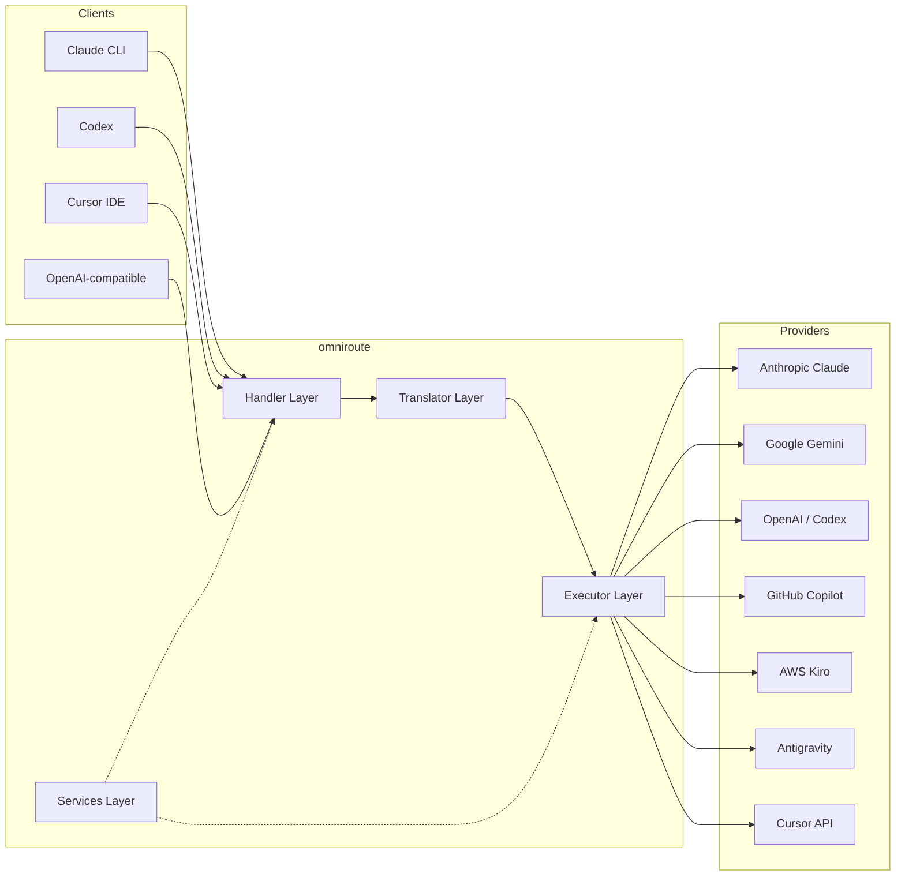

### Keskeinen periaate: Keskittimen ja puheen käännös

Kaikki muotojen käännökset kulkevat **OpenAI-muodon kautta keskittimenä**:

```
Client Format → [OpenAI Hub] → Provider Format    (request)
Provider Format → [OpenAI Hub] → Client Format    (response)
```

Tämä tarkoittaa, että tarvitset vain **N kääntäjää** (yksi per muoto) **N²** (jokainen pari) sijaan.

---

## 3. Projektin rakenne

```
omniroute/
├── open-sse/                  ← Core proxy library (portable, framework-agnostic)
│   ├── index.js               ← Main entry point, exports everything
│   ├── config/                ← Configuration & constants
│   ├── executors/             ← Provider-specific request execution
│   ├── handlers/              ← Request handling orchestration
│   ├── services/              ← Business logic (auth, models, fallback, usage)
│   ├── translator/            ← Format translation engine
│   │   ├── request/           ← Request translators (8 files)
│   │   ├── response/          ← Response translators (7 files)
│   │   └── helpers/           ← Shared translation utilities (6 files)
│   └── utils/                 ← Utility functions
├── src/                       ← Application layer (Express/Worker runtime)
│   ├── app/                   ← Web UI, API routes, middleware
│   ├── lib/                   ← Database, auth, and shared library code
│   ├── mitm/                  ← Man-in-the-middle proxy utilities
│   ├── models/                ← Database models
│   ├── shared/                ← Shared utilities (wrappers around open-sse)
│   ├── sse/                   ← SSE endpoint handlers
│   └── store/                 ← State management
├── data/                      ← Runtime data (credentials, logs)
│   └── provider-credentials.json   (external credentials override, gitignored)
└── tester/                    ← Test utilities
```

---

## 4. Erittely moduulilta

### 4.1 Config (`open-sse/config/`)

**yksi totuuden lähde** kaikille palveluntarjoajan määrityksille.

| Tiedosto                      | Tarkoitus                                                                                                                                                                                                                                                            |
| ----------------------------- | -------------------------------------------------------------------------------------------------------------------------------------------------------------------------------------------------------------------------------------------------------------------- |
| `constants.ts`                | `PROVIDERS`-objekti, jossa on perus-URL-osoitteet, OAuth-tunnistetiedot (oletukset), otsikot ja oletusarvoiset järjestelmäkehotteet jokaiselle palveluntarjoajalle. Määrittää myös `HTTP_STATUS`, `ERROR_TYPES`, `COOLDOWN_MS`, `BACKOFF_CONFIG` ja `SKIP_PATTERNS`. |
| `credentialLoader.ts`         | Lataa ulkoiset valtuustiedot kohteesta `data/provider-credentials.json` ja yhdistää ne kovakoodattujen oletusarvojen päälle dokumentissa `PROVIDERS`. Pitää salaisuudet poissa lähteen hallinnasta säilyttäen samalla yhteensopivuuden taaksepäin.                   |
| `providerModels.ts`           | Keskitetty mallirekisteri: karttatoimittajan aliakset → mallitunnukset. Toiminnot, kuten `getModels()`, `getProviderByAlias()`.                                                                                                                                      |
| `codexInstructions.ts`        | Codex-pyyntöihin lisätyt järjestelmäohjeet (muokkausrajoitukset, hiekkalaatikkosäännöt, hyväksymiskäytännöt).                                                                                                                                                        |
| `defaultThinkingSignature.ts` | Oletusarvoiset "ajattelevat" allekirjoitukset Claude- ja Gemini-malleille.                                                                                                                                                                                           |
| `ollamaModels.ts`             | Kaaviomäärittely paikallisille Ollama-malleille (nimi, koko, perhe, kvantisointi).                                                                                                                                                                                   |

#### Tunnistetietojen latausvirta

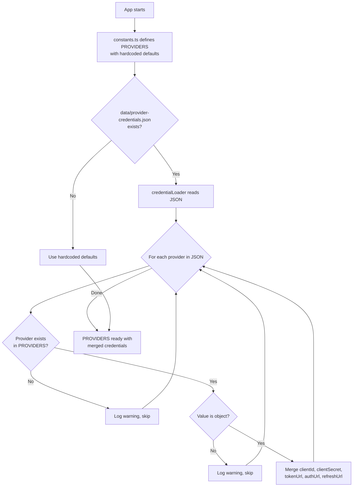

---

### 4.2 Toimeenpanijat (`open-sse/executors/`)

Toteuttajat kapseloivat **palveluntarjoajakohtaisen logiikan** käyttämällä **strategiamallia**. Jokainen suorittaja ohittaa perusmenetelmät tarpeen mukaan.

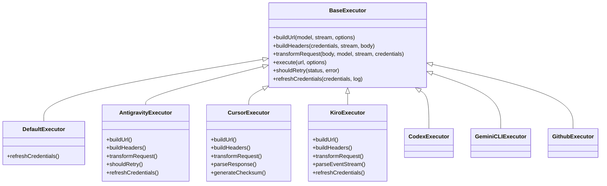

| Toteuttaja       | Palveluntarjoaja                           | Keskeiset erikoisalat                                                                                                                             |
| ---------------- | ------------------------------------------ | ------------------------------------------------------------------------------------------------------------------------------------------------- |
| `base.ts`        | —                                          | Abstrakti pohja: URL-osoitteiden rakentaminen, otsikot, uudelleenyrityslogiikka, tunnistetietojen päivitys                                        |
| `default.ts`     | Claude, Gemini, OpenAI, GLM, Kimi, MiniMax | Yleinen OAuth-tunnuksen päivitys vakiopalveluntarjoajille                                                                                         |
| `antigravity.ts` | Google Cloud Code                          | Projektin/istunnon tunnuksen luominen, usean URL-osoitteen varaosa, mukautettu uudelleenjäsennysyritys virheilmoituksista ("reset after 2t7m23s") |
| `cursor.ts`      | Kohdistin IDE                              | **Monimutkaisin**: SHA-256-tarkistussumman todennus, Protobuf-pyynnön koodaus, binaarinen EventStream → SSE-vastauksen jäsennys                   |
| `codex.ts`       | OpenAI Codex                               | Lisää järjestelmäkäskyjä, hallitsee ajattelutasoja, poistaa ei-tuetut parametrit                                                                  |
| `gemini-cli.ts`  | Google Gemini CLI                          | Muokatun URL-osoitteen rakentaminen (`streamGenerateContent`), Google OAuth -tunnuksen päivitys                                                   |
| `github.ts`      | GitHub Copilot                             | Kaksoistunnistejärjestelmä (GitHub OAuth + Copilot-tunnus), VSCode-otsikon matkiminen                                                             |
| `kiro.ts`        | AWS CodeWhisperer                          | AWS EventStream binäärijäsennys, AMZN-tapahtumakehykset, tunnuksen arviointi                                                                      |
| `index.ts`       | —                                          | Tehdas: karttojen toimittajan nimi → suorittajaluokka, oletusarvolla                                                                              |

---

### 4.3 Käsittelijät (`open-sse/handlers/`)

**orkestrointikerros** — koordinoi käännöstä, suoritusta, suoratoistoa ja virheiden käsittelyä.

| Tiedosto              | Tarkoitus                                                                                                                                                                                                              |
| --------------------- | ---------------------------------------------------------------------------------------------------------------------------------------------------------------------------------------------------------------------- |
| `chatCore.ts`         | **Keskiorkesteri** (~600 riviä). Käsittelee koko pyynnön elinkaaren: muodon tunnistus → käännös → suorittimen lähettäminen → suoratoisto/ei-suoratoistovaste → tunnuksen päivitys → virheiden käsittely → käytön loki. |
| `responsesHandler.ts` | Sovitin OpenAI:n Responses API:lle: muuntaa vastausmuodon → Chat Completions → lähettää osoitteeseen `chatCore` → muuntaa SSE:n takaisin Responses-muotoon.                                                            |
| `embeddings.ts`       | Upottamisen sukupolven käsittelijä: ratkaisee upotusmallin → toimittaja, lähettää palveluntarjoajan API:lle, palauttaa OpenAI-yhteensopivan upotusvastauksen. Tukee 6+ palveluntarjoajia.                              |
| `imageGeneration.ts`  | Kuvanluontikäsittelijä: ratkaisee kuvamallin → palveluntarjoajan, tukee OpenAI-yhteensopivia, Gemini-image- (Antigravity) ja backback (Nebius) -tiloja. Palauttaa base64- tai URL-kuvat.                               |

#### Pyydä elinkaarta (chatCore.ts)

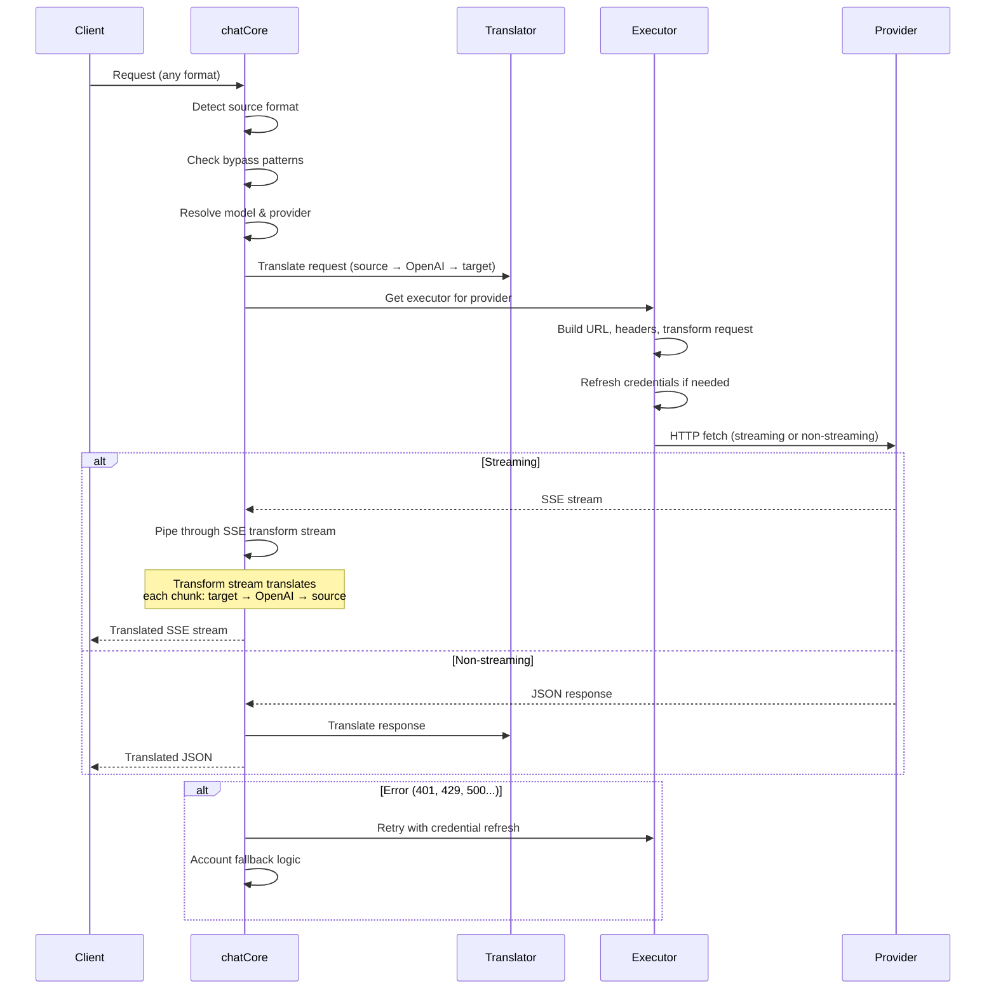

---

### 4.4 Palvelut (`open-sse/services/`)

Liiketoimintalogiikka, joka tukee käsittelijöitä ja toimeenpanijoita.

| Tiedosto             | Tarkoitus                                                                                                                                                                                                                                                                                                                                                                |
| -------------------- | ------------------------------------------------------------------------------------------------------------------------------------------------------------------------------------------------------------------------------------------------------------------------------------------------------------------------------------------------------------------------ |
| `provider.ts`        | **Muodon tunnistus** (`detectFormat`): analysoi pyyntörunkorakenteen tunnistaakseen Claude-/OpenAI-/Gemini-/Antigravity-/Responses-muodot (sisältää Clauden `max_tokens`-heuristiikan). Myös: URL-osoitteiden rakentaminen, otsikon rakentaminen, ajatteluasetusten normalisointi. Tukee dynaamisia palveluntarjoajia `openai-compatible-*` ja `anthropic-compatible-*`. |
| `model.ts`           | Mallin merkkijonon jäsennys (`claude/model-name` → `{provider: "claude", model: "model-name"}`), aliaksen tarkkuus törmäystunnistuksen kanssa, syötteen puhdistus (hylkää polun läpikulku/ohjausmerkit) ja mallitietojen resoluutio asynkronisen aliaksen hakijan tuella.                                                                                                |
| `accountFallback.ts` | Rate-limit käsittely: eksponentiaalinen backoff (1s → 2s → 4s → max 2min), tilin jäähtymisen hallinta, virheluokitus (jotka virheet laukaisevat varauksen tai eivät).                                                                                                                                                                                                    |
| `tokenRefresh.ts`    | OAuth-tunnuksen päivitys **jokaiselle palveluntarjoajalle**: Google (Gemini, Antigravity), Claude, Codex, Qwen, iFlow, GitHub (OAuth + Copilot dual-token), Kiro (AWS SSO OIDC + Social Auth). Sisältää lennon aikana tapahtuvan lupauksen poistamisen välimuistin ja uudelleenyrityksen eksponentiaalisella peruutuksella.                                              |
| `combo.ts`           | **Yhdistelmämallit**: varamallien ketjut. Jos malli A epäonnistuu varautumiskelpoisen virheen vuoksi, kokeile mallia B, sitten C jne. Palauttaa todelliset ylävirran tilakoodit.                                                                                                                                                                                         |
| `usage.ts`           | Hakee kiintiö-/käyttötiedot palveluntarjoajan sovellusliittymistä (GitHub Copilot -kiintiöt, Antigravity-mallikiintiöt, Codexin nopeusrajoitukset, Kiron käyttöerittelyt, Claude-asetukset).                                                                                                                                                                             |
| `accountSelector.ts` | Älykäs tilin valinta pisteytysalgoritmilla: ottaa huomioon prioriteetin, terveydentilan, kiertorajan sijainnin ja jäähtymistilan valitakseen optimaalisen tilin kullekin pyynnölle.                                                                                                                                                                                      |
| `contextManager.ts`  | Pyynnön kontekstin elinkaaren hallinta: luo ja seuraa pyyntökohtaisia ​​kontekstiobjekteja metatiedoilla (pyyntötunnus, aikaleimat, palveluntarjoajan tiedot) virheenkorjausta ja lokia varten.                                                                                                                                                                          |
| `ipFilter.ts`        | IP-pohjainen pääsynhallinta: tukee sallittu- ja estolistatiloja. Vahvistaa asiakkaan IP-osoitteen määritettyjen sääntöjen mukaan ennen API-pyyntöjen käsittelemistä.                                                                                                                                                                                                     |
| `sessionManager.ts`  | Istuntoseuranta asiakkaan sormenjälkien avulla: seuraa aktiivisia istuntoja hajautettujen asiakastunnisteiden avulla, valvoo pyyntöjen määrää ja tarjoaa istuntomittareita.                                                                                                                                                                                              |
| `signatureCache.ts`  | Pyynnön allekirjoituspohjainen deduplikoinnin välimuisti: estää päällekkäiset pyynnöt tallentamalla välimuistiin viimeaikaiset pyyntöjen allekirjoitukset ja palauttamalla välimuistissa olevat vastaukset identtisille pyynnöille tietyn aikaikkunan sisällä.                                                                                                           |
| `systemPrompt.ts`    | Yleinen järjestelmäkehotteen lisäys: liittää kaikkien pyyntöjen edelle tai liittää määritettävän järjestelmäkehotteen palveluntarjoajakohtaisen yhteensopivuuden käsittelyn avulla.                                                                                                                                                                                      |
| `thinkingBudget.ts`  | Päättelytunnisteen budjetin hallinta: tukee läpivienti-, automaatti- (kaistaleiden ajattelukonfiguraatio), mukautettua (kiinteä budjetti) ja mukautuva (monimutkaisuusskaalaus) -tiloja ajattelun/päättelyn hallintaan.                                                                                                                                                  |
| `wildcardRouter.ts`  | Jokerimerkkimallin reititys: ratkaisee jokerimerkkimallit (esim. `*/claude-*`) konkreettisiksi toimittaja/malli-pareiksi saatavuuden ja prioriteetin perusteella.                                                                                                                                                                                                        |

#### Token Refresh Deduplication

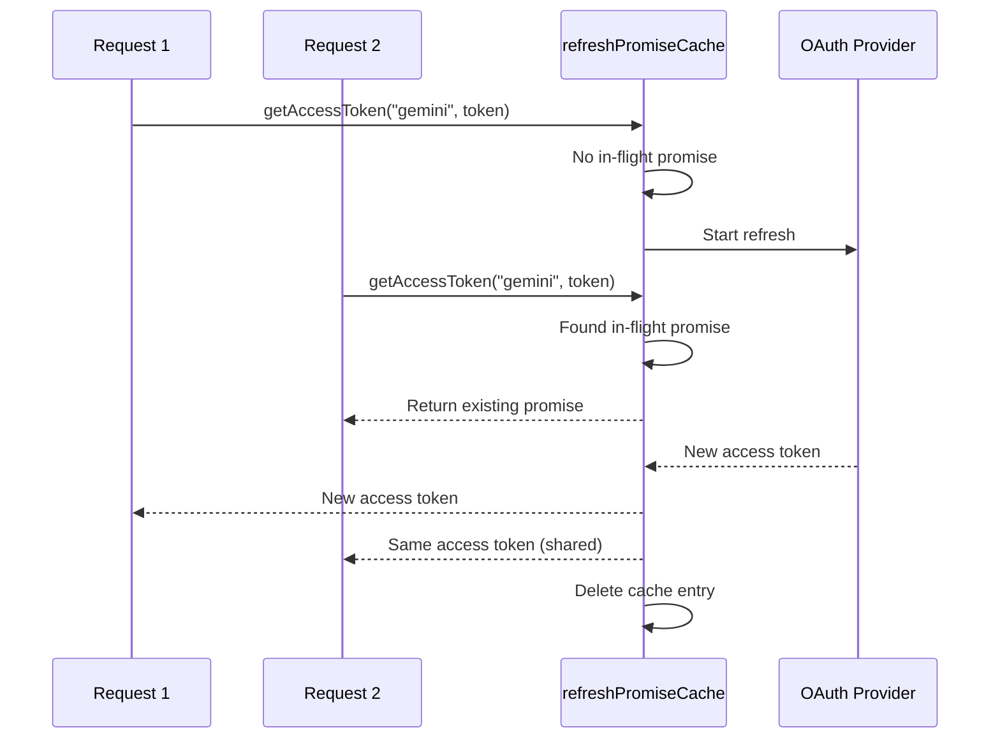

#### Tilin varatilakone

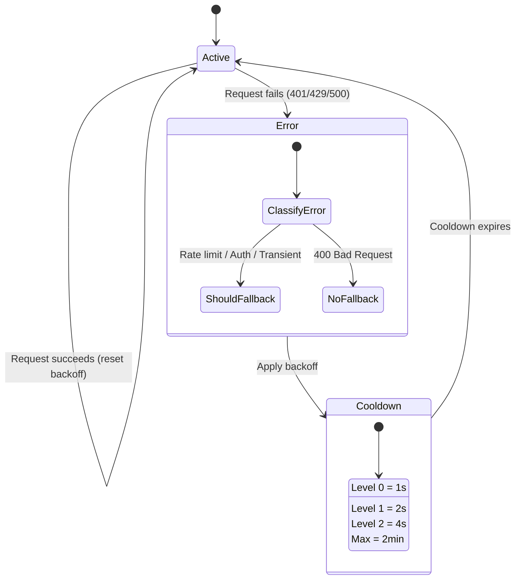

#### Yhdistelmämalliketju

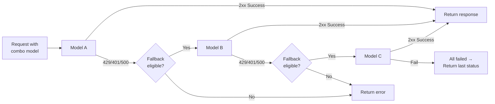

---

### 4.5 Kääntäjä (`open-sse/translator/`)

**muotojen käännösmoottori**, joka käyttää itse rekisteröivää laajennusjärjestelmää.

#### Arkkitehtuuri

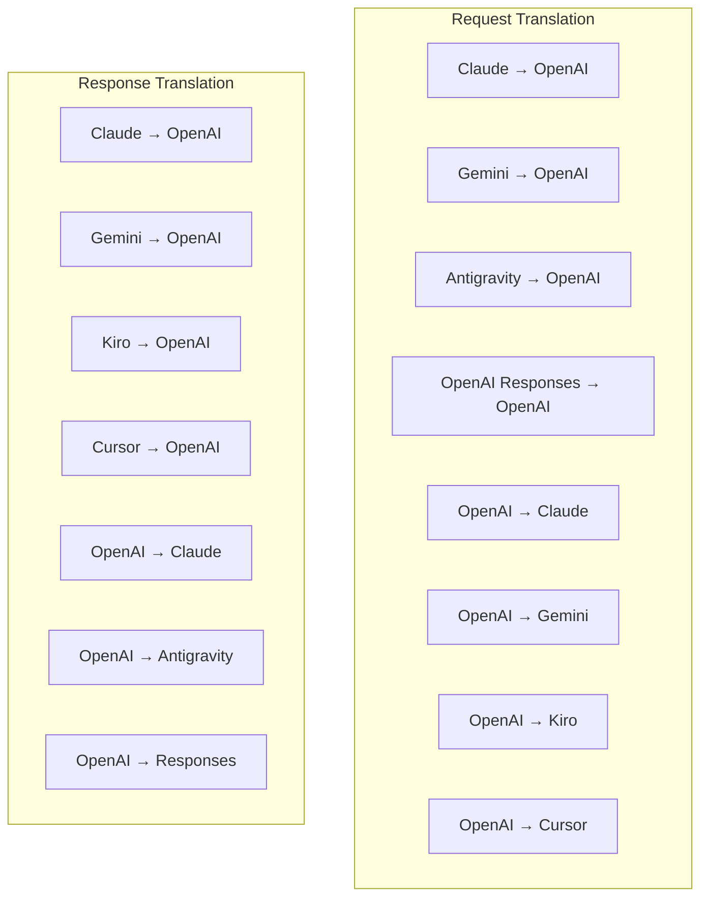

| Hakemisto    | Tiedostot   | Kuvaus                                                                                                                                                                                                                                                 |
| ------------ | ----------- | ------------------------------------------------------------------------------------------------------------------------------------------------------------------------------------------------------------------------------------------------------ |
| `request/`   | 8 kääntäjää | Muunna pyyntörungot muotojen välillä. Jokainen tiedosto rekisteröi itse itsensä tuonnin yhteydessä `register(from, to, fn)`:n kautta.                                                                                                                  |
| `response/`  | 7 kääntäjää | Muunna suoratoistovastauspalat muotojen välillä. Käsittelee SSE-tapahtumatyyppejä, ajattelulohkoja, työkalukutsuja.                                                                                                                                    |
| `helpers/`   | 6 avustajaa | Jaetut apuohjelmat: `claudeHelper` (järjestelmäkehotteen purkaminen, ajattelukonfiguraatio), `geminiHelper` (osien/sisällön kartoitus), `openaiHelper` (muotosuodatus), `toolCallHelper`), \_TOK-sukupolvi_EN_1, vastaus puuttuu `responsesApiHelper`. |
| `index.ts`   | —           | Käännöskone: `translateRequest()`, `translateResponse()`, tilanhallinta, rekisteri.                                                                                                                                                                    |
| `formats.ts` | —           | Muotovakiot: `OPENAI`, `CLAUDE`, `GEMINI`, `ANTIGRAVITY`, `KIRO`, `CURSOR`_, \_\_EN_92_NI, _.                                                                                                                                                          |

#### Avainsuunnittelu: Itserekisteröityvät laajennukset

```javascript
// Each translator file calls register() on import:
import { register } from "../index.js";
register("claude", "openai", translateClaudeToOpenAI);

// The index.js imports all translator files, triggering registration:
import "./request/claude-to-openai.js"; // ← self-registers
```

---

### 4.6 Utilis (`open-sse/utils/`)

| Tiedosto           | Tarkoitus                                                                                                                                                                                                                                                                                             |
| ------------------ | ----------------------------------------------------------------------------------------------------------------------------------------------------------------------------------------------------------------------------------------------------------------------------------------------------- |
| `error.ts`         | Virhevastausten rakentaminen (OpenAI-yhteensopiva muoto), ylävirran virheen jäsennys, Antigravitaatio-uudelleenyritysten poimiminen virheilmoituksista, SSE-virheiden suoratoisto.                                                                                                                    |
| `stream.ts`        | **SSE Transform Stream** — suoratoiston ydinputki. Kaksi tilaa: `TRANSLATE` (täysmuotoinen käännös) ja `PASSTHROUGH` (normalisoi + pura käyttö). Käsittelee osien puskuroinnin, käyttöarvioinnin ja sisällön pituuden seurannan. Virtakohtaiset enkooderi/dekooderiinstanssit välttävät jaetun tilan. |
| `streamHelpers.ts` | Matalan tason SSE-apuohjelmat: `parseSSELine` (välilyöntejä sietävä), `hasValuableContent` (suodattaa tyhjät osat OpenAI:lle/Claudelle/Geminille), `fixInvalidId`, `fixInvalidId`, \_\_OMNI_TOKEN_1SE-serialization `perf_metrics` puhdistus).                                                        |
| `usageTracking.ts` | Tokenin käytön poiminta mistä tahansa muodosta (Claude/OpenAI/Gemini/Responses), arvio erillisillä työkalu/viestin char-per-token-suhteilla, puskurin lisäys (2000 merkkiä turvamarginaali), muotokohtainen kenttäsuodatus, konsolin kirjaaminen ANSI-väreillä.                                       |
| `requestLogger.ts` | Tiedostopohjainen pyyntöjen kirjaaminen (osallistu osoitteen `ENABLE_REQUEST_LOGS=true` kautta). Luo istuntokansioita numeroiduilla tiedostoilla: `1_req_client.json` → `7_res_client.txt`. Kaikki I/O on async (fire-and-forget). Peittää herkät otsikot.                                            |
| `bypassHandler.ts` | Kaappaa tiettyjä malleja Claude CLI:stä (otsikon poimiminen, lämmittely, laskenta) ja palauttaa vääriä vastauksia soittamatta palveluntarjoajille. Tukee sekä suoratoistoa että ei-suoratoistoa. Tarkoituksella rajoitettu Claude CLI:n soveltamisalaan.                                              |
| `networkProxy.ts`  | Ratkaisee tietyn palveluntarjoajan lähtevän välityspalvelimen URL-osoitteen etusijalla: palveluntarjoajakohtainen määritys → globaali määritys → ympäristömuuttujat (`HTTPS_PROXY`/`HTTP_PROXY`/`ALL_PROXY`). Tukee `NO_PROXY` poissulkemista. Välimuistin konfiguraatio 30 sekuntia.                 |

#### SSE Streaming Pipeline

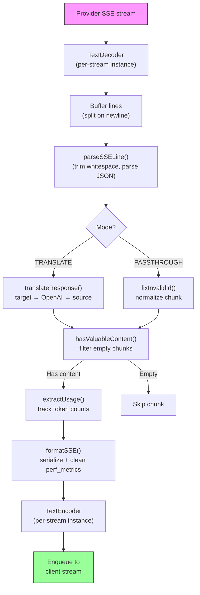

#### Pyydä Loggerin istuntorakennetta

```
logs/
└── claude_gemini_claude-sonnet_20260208_143045/
    ├── 1_req_client.json      ← Raw client request
    ├── 2_req_source.json      ← After initial conversion
    ├── 3_req_openai.json      ← OpenAI intermediate format
    ├── 4_req_target.json      ← Final target format
    ├── 5_res_provider.txt     ← Provider SSE chunks (streaming)
    ├── 5_res_provider.json    ← Provider response (non-streaming)
    ├── 6_res_openai.txt       ← OpenAI intermediate chunks
    ├── 7_res_client.txt       ← Client-facing SSE chunks
    └── 6_error.json           ← Error details (if any)
```

---

### 4.7 Sovelluskerros (`src/`)

| Hakemisto     | Tarkoitus                                                                               |
| ------------- | --------------------------------------------------------------------------------------- |
| `src/app/`    | Verkkokäyttöliittymä, API-reitit, Express-väliohjelmisto, OAuth-soittojen käsittelijät  |
| `src/lib/`    | Tietokannan käyttöoikeus (`localDb.ts`, `usageDb.ts`), todennus, jaettu                 |
| `src/mitm/`   | Man-in-the-middle-välityspalvelinapuohjelmat palveluntarjoajan liikenteen sieppaamiseen |
| `src/models/` | Tietokantamallin määritelmät                                                            |
| `src/shared/` | Open-sse-funktioiden kääreet (tarjoaja, virta, virhe jne.)                              |
| `src/sse/`    | SSE-päätepisteen käsittelijät, jotka yhdistävät avoimen SS-kirjaston Express-reiteille  |
| `src/store/`  | Sovellustilan hallinta                                                                  |

#### Merkittäviä API-reitit

| Reitti                                        | Menetelmät          | Tarkoitus                                                                                       |
| --------------------------------------------- | ------------------- | ----------------------------------------------------------------------------------------------- |
| `/api/provider-models`                        | HANKI/LÄHETÄ/POISTA | CRUD mukautetuille malleille toimittajakohtaisesti                                              |
| `/api/models/catalog`                         | HANKI               | Koottu luettelo kaikista malleista (chat, upotus, kuva, mukautettu) ryhmitelty tarjoajan mukaan |
| `/api/settings/proxy`                         | GET/PUT/DELETE      | Hierarkkinen lähtevän välityspalvelimen määritys (`global/providers/combos/keys`)               |
| `/api/settings/proxy/test`                    | POST                | Vahvistaa välityspalvelinyhteyden ja palauttaa julkisen IP-osoitteen/latenssin                  |
| `/v1/providers/[provider]/chat/completions`   | POST                | Palveluntarjoajakohtaiset keskustelut ja mallin vahvistus                                       |
| `/v1/providers/[provider]/embeddings`         | POST                | Palveluntarjoajakohtaiset upotukset mallin vahvistuksella                                       |
| `/v1/providers/[provider]/images/generations` | POST                | Palveluntarjoajakohtainen kuvien luominen mallin tarkistuksen kanssa                            |
| `/api/settings/ip-filter`                     | GET/PUT             | IP-sallittujen/estoluetteloiden hallinta                                                        |
| `/api/settings/thinking-budget`               | GET/PUT             | Päättelytunnuksen budjetin määritys (passthrough/auto/custom/adaptive)                          |
| `/api/settings/system-prompt`                 | GET/PUT             | Globaali järjestelmän pikainjektio kaikkiin pyyntöihin                                          |
| `/api/sessions`                               | HANKI               | Aktiivisen istunnon seuranta ja mittarit                                                        |
| `/api/rate-limits`                            | HANKI               | Tilikohtaisen koron rajan tila                                                                  |

---

## 5. Key Design Patterns

### 5.1 Hub-and-Spoke -käännös

Kaikki muodot käännetään **OpenAI-muodon kautta keskittimenä**. Uuden palveluntarjoajan lisääminen edellyttää vain **yksi parin** kirjoittamista (OpenAI:lle/OpenAI:sta), ei N paria.

### 5.2 Toteuttajastrategiamalli

Jokaisella palveluntarjoajalla on oma suorittajaluokka, joka perii `BaseExecutor`. Tehdas kohteessa `executors/index.ts` valitsee oikean suorituksen aikana.

### 5.3 Itserekisteröivä laajennusjärjestelmä

Kääntäjämoduulit rekisteröivät itsensä tuontia varten osoitteessa `register()`. Uuden kääntäjän lisääminen on vain tiedoston luomista ja sen tuomista.

### 5.4 Tilin palautus eksponentiaalisella backoffilla

Kun palveluntarjoaja palauttaa numeron 429/401/500, järjestelmä voi siirtyä seuraavalle tilille käyttämällä eksponentiaalisia viilennyksiä (1 s → 2 s → 4 s → max 2 min).

### 5.5 yhdistelmämalliketjut

"Yhdistelmä" ryhmittelee useita `provider/model` merkkijonoja. Jos ensimmäinen epäonnistuu, palaa automaattisesti seuraavaan.

### 5.6 Tilallinen suoratoistokäännös

Vastauskäännös säilyttää tilan SSE-paloissa (ajattelulohkojen seuranta, työkalukutsujen kerääminen, sisältölohkojen indeksointi) `initState()`-mekanismin kautta.

### 5.7 Käyttöturvapuskuri

Raportoituun käyttöön lisätään 2 000 tunnuksen puskuri, joka estää asiakkaita saavuttamasta kontekstiikkunan rajoja järjestelmäkehotteiden ja muotojen käännöksen aiheuttaman ylimääräisen rasituksen vuoksi.

---

## 6. Tuetut muodot

| Muoto                                  | Suunta        | Tunniste           |
| -------------------------------------- | ------------- | ------------------ |
| OpenAI-keskustelun loppuun saattaminen | lähde + kohde | `openai`           |
| OpenAI Responses API                   | lähde + kohde | `openai-responses` |
| Antrooppinen Claude                    | lähde + kohde | `claude`           |
| Google Gemini                          | lähde + kohde | `gemini`           |
| Google Gemini CLI                      | vain kohde    | `gemini-cli`       |
| Antigravitaatio                        | lähde + kohde | `antigravity`      |
| AWS Kiro                               | vain kohde    | `kiro`             |
| Kursori                                | vain kohde    | `cursor`           |

---

## 7. Tuetut palveluntarjoajat

| Palveluntarjoaja         | Todennusmenetelmä         | Toteuttaja      | Tärkeimmät huomautukset                                    |
| ------------------------ | ------------------------- | --------------- | ---------------------------------------------------------- |
| Antrooppinen Claude      | API-avain tai OAuth       | Oletus          | Käyttää `x-api-key`-otsikkoa                               |
| Google Gemini            | API-avain tai OAuth       | Oletus          | Käyttää `x-goog-api-key`-otsikkoa                          |
| Google Gemini CLI        | OAuth                     | GeminiCLI       | Käyttää `streamGenerateContent` päätepistettä              |
| Antigravitaatio          | OAuth                     | Antigravitaatio | Usean URL-osoitteen varaosa, mukautettu jäsennys uudelleen |
| OpenAI                   | API-avain                 | Oletus          | Vakiosiirtotodennus                                        |
| Codex                    | OAuth                     | Codex           | Ruiskuttaa järjestelmäohjeita, hallitsee ajattelua         |
| GitHub Copilot           | OAuth + Copilot-tunnus    | Github          | Kaksoistunnus, VSCode-otsikkoa jäljittelevä                |
| Kiro (AWS)               | AWS SSO OIDC tai Social   | Kiro            | Binäärinen EventStream-jäsennys                            |
| Kohdistin IDE            | Tarkistussumma auth       | Kursori         | Protobuf-koodaus, SHA-256-tarkistussummat                  |
| Qwen                     | OAuth                     | Oletus          | Vakiotodennus                                              |
| iFlow                    | OAuth (Perus + siirtotie) | Oletus          | Dual auth otsikko                                          |
| OpenRouter               | API-avain                 | Oletus          | Vakiosiirtotodennus                                        |
| GLM, Kimi, MiniMax       | API-avain                 | Oletus          | Claude-yhteensopiva, käytä `x-api-key`                     |
| `openai-compatible-*`    | API-avain                 | Oletus          | Dynaaminen: mikä tahansa OpenAI-yhteensopiva päätepiste    |
| `anthropic-compatible-*` | API-avain                 | Oletus          | Dynaaminen: mikä tahansa Claude-yhteensopiva päätepiste    |

---

## 8. Tietovirran yhteenveto

### Suoratoistopyyntö

```mermaid
flowchart LR
    A["Client"] --> B["detectFormat()"]
    B --> C["translateRequest()\nsource → OpenAI → target"]
    C --> D["Executor\nbuildUrl + buildHeaders"]
    D --> E["fetch(providerURL)"]
    E --> F["createSSEStream()\nTRANSLATE mode"]
    F --> G["parseSSELine()"]
    G --> H["translateResponse()\ntarget → OpenAI → source"]
    H --> I["extractUsage()\n+ addBuffer"]
    I --> J["formatSSE()"]
    J --> K["Client receives\ntranslated SSE"]
    K --> L["logUsage()\nsaveRequestUsage()"]
```

### Ei-suoratoistopyyntö

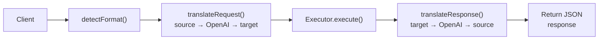

### Ohitusvirtaus (Claude CLI)

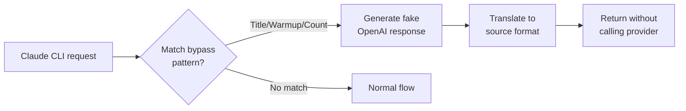
